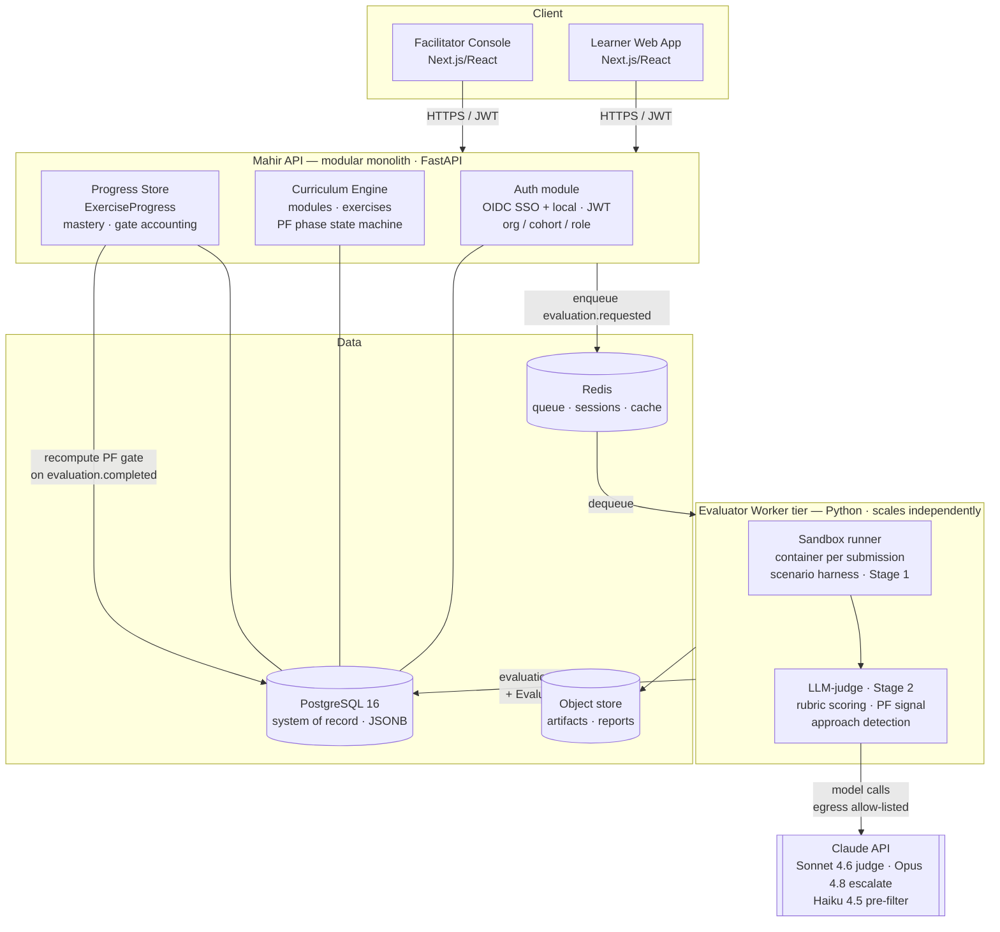

# Mahir — System Architecture Overview (Co-Worker Pilot)

- **Status:** Accepted
- **Date:** 2026-06-11
- **Author:** atlas-architect-mahir
- **Task:** ARCH-001
- **Purpose:** Single-page map of the Mahir system for the crew. The binding decisions live in the ADRs; this is the orientation document.
- **Related:** ADR-001…005, data-model.md, api/mahir-api.yaml, events/evaluation-events.md

## What Mahir is

AI-capability training for the MY/SG market that teaches people to **build** AI agents (not just prompt) via **Productive Failure**. One curriculum engine, two editions (Co-Worker / corporate, Co-Founder / teen). The **Co-Worker** edition is the grant-funded pilot; corporate-first; prove the curriculum + evaluator before building a platform.

## Component diagram

## The four named components → where they live

| PRD component | Realised as | ADR |
|---------------|-------------|-----|
| **Curriculum engine** | Module of the API; owns content delivery + the **PF phase state machine** | [[ADR-004-productive-failure-sequencing]], [[ADR-005-service-decomposition]] |
| **Evaluator service** | Separate worker tier (sandbox + LLM-judge), async via queue | [[ADR-003-evaluator-design]], [[ADR-005-service-decomposition]] |
| **Learner-progress store** | Module of the API + `ExerciseProgress` tables; server-authoritative gate state | [[ADR-004-productive-failure-sequencing]], [[ADR-002-database]] |
| **Auth layer** | Module of the API; OIDC corporate SSO + local fallback; org/cohort/role | [[ADR-001-tech-stack]], data-model.md |

## The core learning loop (Productive Failure)

1. Learner opens an exercise → `phase: not_started → exploring`. Sees the **ill-structured problem only** (no canonical method).
2. Learner **builds an agent** and submits → async evaluation (`202`, `status: queued`).
3. Evaluator runs the agent in a **sandbox** against scenarios (Stage 1), then an **LLM-judge** scores quality and emits a **Productive-Failure signal** + detected approach (Stage 2) → structured `EvaluationResult`.
4. On `evaluation.completed`, the **PF gate** recomputes: genuine attempts, approach variety, exploration time. **Failing is fine; exploring is required.**
5. When the gate is satisfied → `phase: consolidation_unlocked`. Only now is the **canonical solution + teardown** served.
6. Learner completes the consolidation check → `phase: completed`.

Facilitators see real signals throughout (explored vs bypassed, variety, effort) and can override gates (audited).

## Cross-cutting decisions (quick reference)

- **Stack:** Python/FastAPI backend + evaluator; TypeScript/Next.js frontend; Claude for judge/agent runtime. [[ADR-001-tech-stack]]
- **Data:** PostgreSQL system-of-record (+JSONB), Redis (queue/hot), object store (artifacts). [[ADR-002-database]]
- **Decomposition:** modular monolith API + separate evaluator worker tier (runtime asymmetry + isolation). [[ADR-005-service-decomposition]]
- **Model policy:** Sonnet 4.6 default judge, Opus 4.8 escalation, Haiku 4.5 pre-filter, Batches for cohort runs, rubric-prefix prompt caching, per-result cost accounting. [[ADR-001-tech-stack]], [[ADR-003-evaluator-design]]
- **Security edge:** the sandbox is the one place running untrusted code — egress allow-listed, secrets never in-sandbox. [[ADR-003-evaluator-design]]

## Deploy posture (from DEFINITION.md)

Staging-local-first → autodeploy OFF → branch pinned → runtime smoke test → controlled cutover. **Never deploy to prod without staging verification.** No repo/staging configured yet — these must be defined before any cutover; flagged to Quinn/Iris as a downstream gate.

## Open items for downstream specialists

- **Backend (felix):** implement the modular monolith + evaluator worker against this contract; the sandbox runtime is the highest-risk piece.
- **QA (vera):** the PF gate logic and the failure≠low-score distinction are the highest-value test targets.
- **Frontend (wren) + design (mira):** the UI must reflect async `submission.status` and the PF phases honestly — never reveal consolidation client-side ahead of the gate.
- **Coord (iris) / PM (quinn):** repo, staging environment, and deploy branch are unconfigured (`DEFINITION.md`) — needed before cutover.
